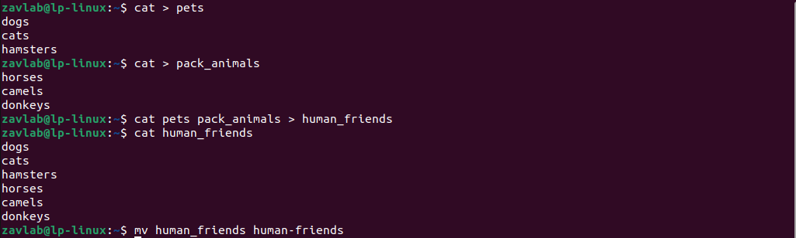
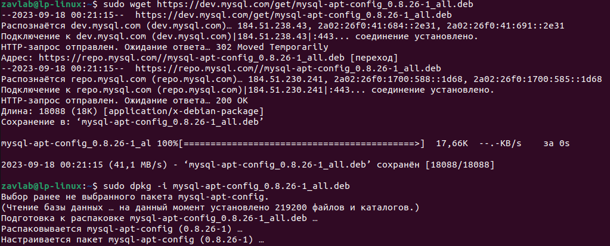
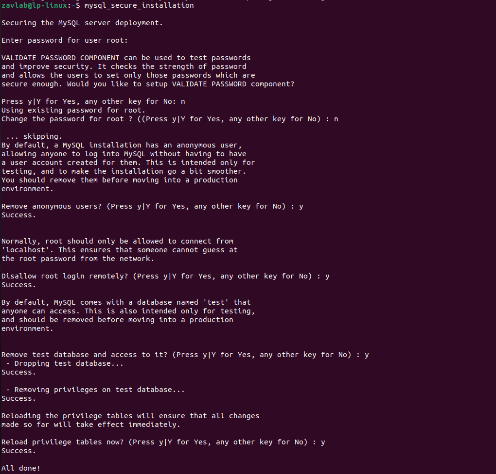
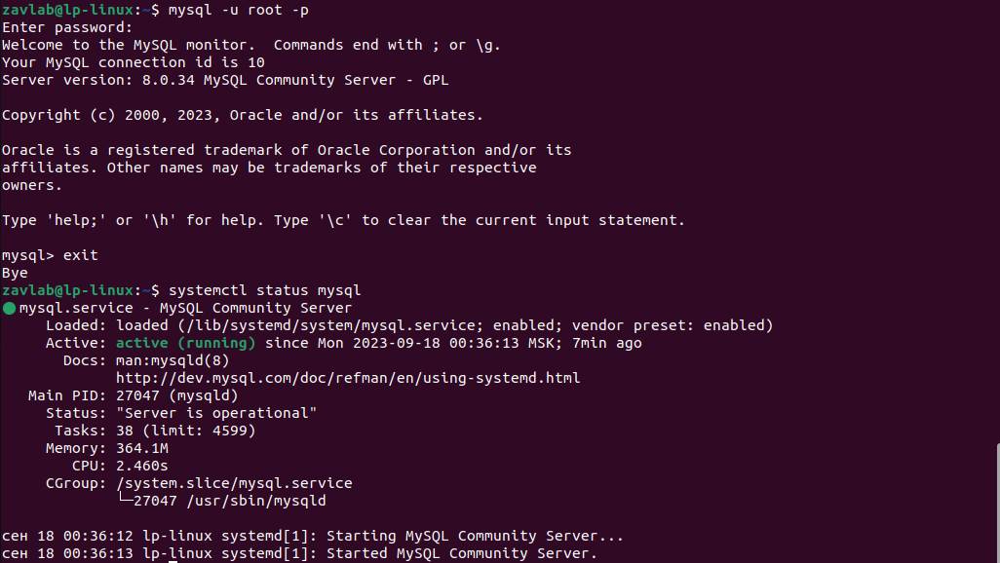
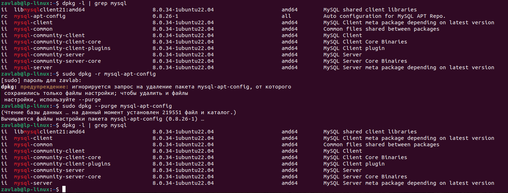
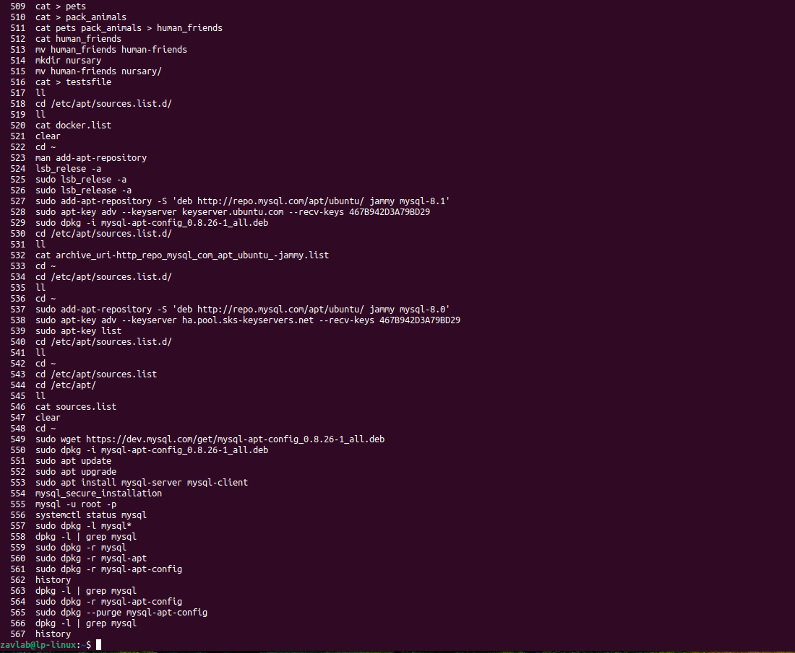

# Итоговая контрольная работа

## Информация о проекте

**Необходимо организовать систему учета для питомника в котором живут
домашние и вьючные животные.**

## Задание

1. **Используя команду cat в терминале операционной системы Linux, создать два файла: Домашние животные, заполнив файл собаками, кошками, хомяками и Вьючные животные, заполнив файл Лошадьми, верблюдами и
ослами, а затем объединить их. Просмотреть содержимое созданного файла.
Переименовать файл, дав ему новое имя (Друзья человека).**

2. **Создать директорию, переместить файл туда.**

   
3. **Подключить дополнительный репозиторий MySQL. Установить любой пакет из этого репозитория.**

   **Для установки пакета из дополнительного репозитория мы воспользуемся способом описанным в документации разработчиков MySQL - <https://dev.mysql.com/doc/mysql-apt-repo-quick-guide/en/#repo-qg-apt-replace-direct>.**

   **Дополнительный репозиторий находится по адресу <https://dev.mysql.com/downloads/repo/apt/>.**
   **Оттуда мы и скачаем deb-пакет и с помощью утилиты dpkg его установим.**

   

   **Установим MySQL и проведем его настройку, в том числе позаботимся о безопасности.**

   

    **Проверим возможность подключения и статус MySQL.**

    

4. **Установить и удалить deb-пакет с помощью dpkg.**

   **После установки deb-пакет с MySQL нам больше не нужен и мы можем его удалить. Так как после удаления остались зависимости, то их мы тоже удалим.**

   

5. **Выложить историю команд в терминале ubuntu.**
   **Воспользуемся командой history.**

   

