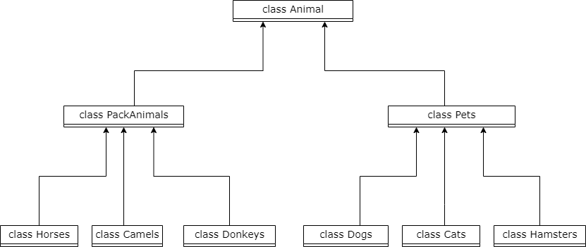
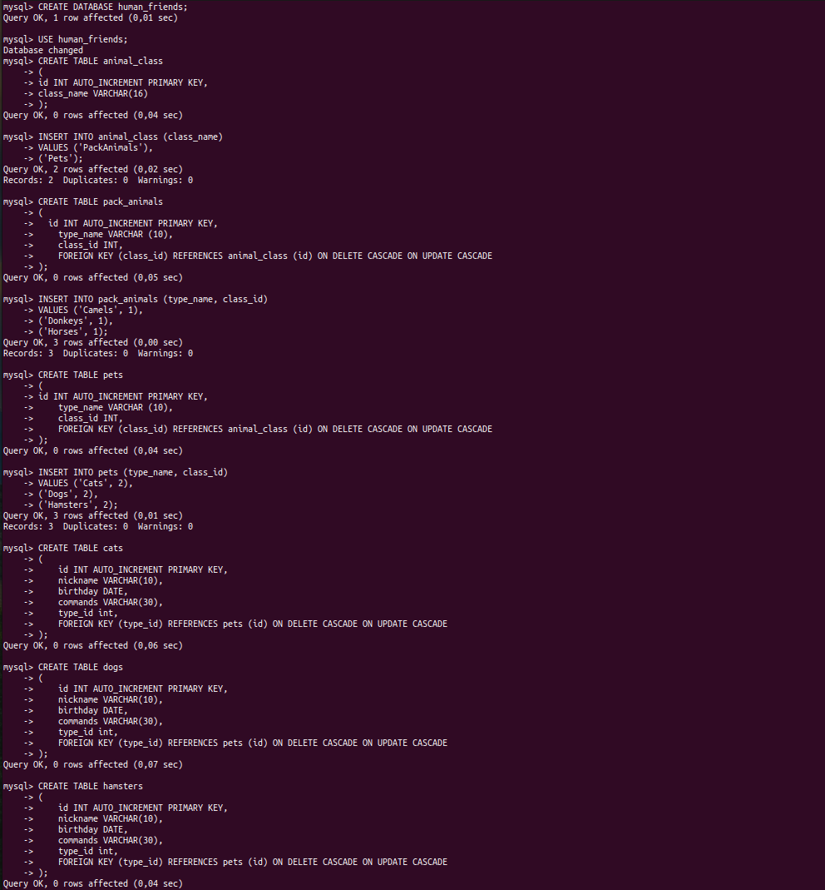
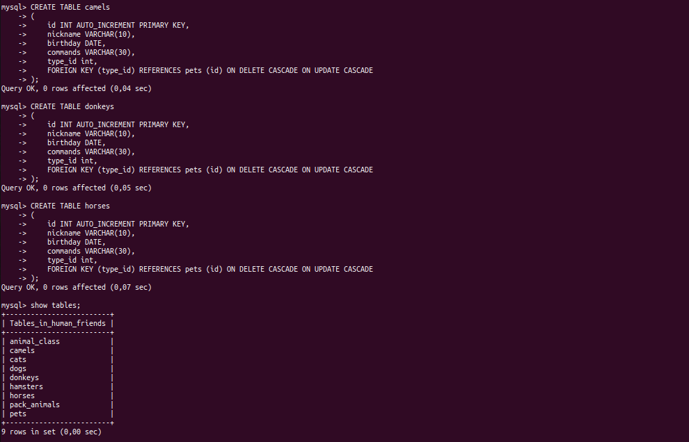
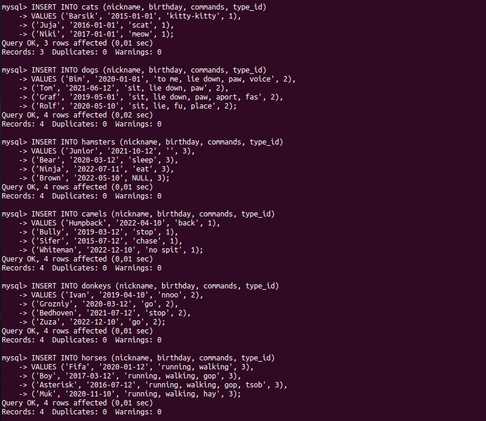
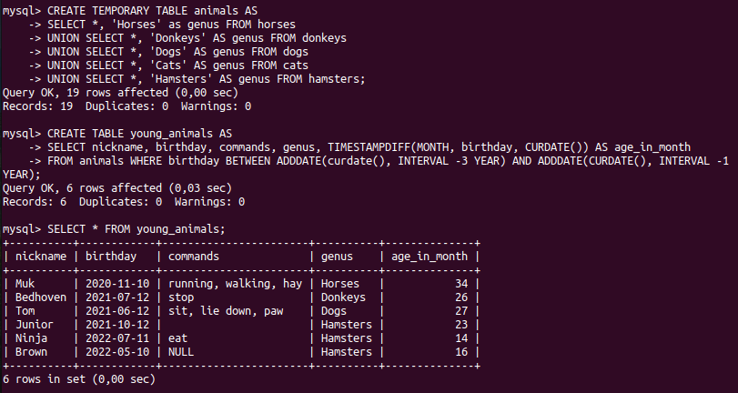
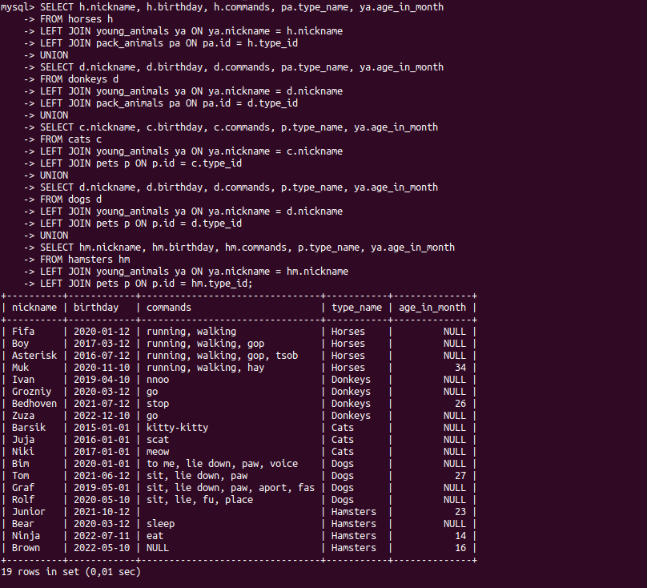

# Итоговая контрольная работа

## Информация о проекте

**Необходимо организовать систему учета для питомника в котором живут
домашние и вьючные животные.**

## Задание

1. **Используя команду cat в терминале операционной системы Linux, создать два файла: Домашние животные, заполнив файл собаками, кошками, хомяками и Вьючные животные, заполнив файл Лошадьми, верблюдами и
ослами, а затем объединить их. Просмотреть содержимое созданного файла.
Переименовать файл, дав ему новое имя (Друзья человека).**

2. **Создать директорию, переместить файл туда.**

   
3. **Подключить дополнительный репозиторий MySQL. Установить любой пакет из этого репозитория.**

   **Для установки пакета из дополнительного репозитория мы воспользуемся способом описанным в документации разработчиков MySQL - <https://dev.mysql.com/doc/mysql-apt-repo-quick-guide/en/#repo-qg-apt-replace-direct>.**

   **Дополнительный репозиторий находится по адресу <https://dev.mysql.com/downloads/repo/apt/>.**
   **Оттуда мы и скачаем deb-пакет и с помощью утилиты dpkg его установим.**

   

   **Установим MySQL и проведем его настройку, в том числе позаботимся о безопасности.**

   

    **Проверим возможность подключения и статус MySQL.**

    

4. **Установить и удалить deb-пакет с помощью dpkg.**

   **После установки deb-пакет с MySQL нам больше не нужен и мы можем его удалить. Так как после удаления остались зависимости, то их мы тоже удалим.**

   

5. **Выложить историю команд в терминале ubuntu.**
   **Воспользуемся командой history.**

   

6. **Нарисовать диаграмму, в которой есть класс родительский класс, домашние животные и вьючные животные, в составы которых в случае домашних животных войдут классы: собаки, кошки, хомяки, а в класс вьючные животные войдут: лошади, верблюды и ослы.**

   

7. **В подключенном MySQL репозитории создать базу данных “Друзья человека”.**

   

8. **Создать таблицы с иерархией из диаграммы в БД**

    
    

9. **Заполнить низкоуровневые таблицы именами(животных), командами которые они выполняют и датами рождения.**

    

10. **Удалив из таблицы верблюдов, т.к. верблюдов решили перевезти в другой питомник на зимовку. Объединить таблицы лошади, и ослы в одну таблицу.**

    

11. **Создать новую таблицу “молодые животные” в которую попадут все животные старше 1 года, но младше 3 лет и в отдельном столбце с точностью до месяца подсчитать возраст животных в новой таблице.**

      

12. **Объединить все таблицы в одну, при этом сохраняя поля, указывающие на прошлую принадлежность к старым таблицам.**

      

13. **Создать класс с Инкапсуляцией методов и наследованием по диаграмме.**

    [Создан класс Pets](https://github.com/eugenepro777/nursery_test_work/tree/main/pet_registry/src/main/java/model)
14. **Написать программу, имитирующую работу реестра домашних животных.**
**В программе должен быть реализован следующий функционал:**

    - **Завести новое животное**
    - **определять животное в правильный класс**
    - **увидеть список команд, которое выполняет животное**
    - **обучить животное новым командам**
    - **Реализовать навигацию по меню**
  
      [Пример программы](https://github.com/eugenepro777/nursery_test_work/tree/main/pet_registry/src/main/java/)
15. **Создайте класс Счетчик, у которого есть метод add(), увеличивающий значение внутренней int переменной на 1 при нажатие “Завести новое животное”. Сделайте так, чтобы с объектом такого типа можно было работать в
блоке try-with-resources. Нужно бросить исключение, если работа с объектом типа счетчик была не в ресурсном try и/или ресурс остался открыт. Значение считать в ресурсе try, если при заведения животного заполнены все поля.**

      [Пример решения](https://github.com/eugenepro777/nursery_test_work/blob/main/pet_registry/src/main/java/controller/Counter.java)

[В начало &#11014;](#итоговая-контрольная-работа)
